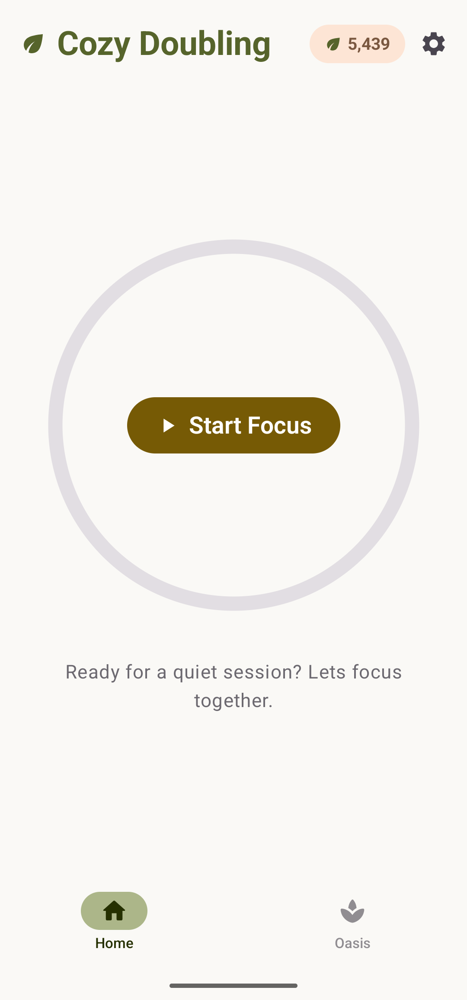
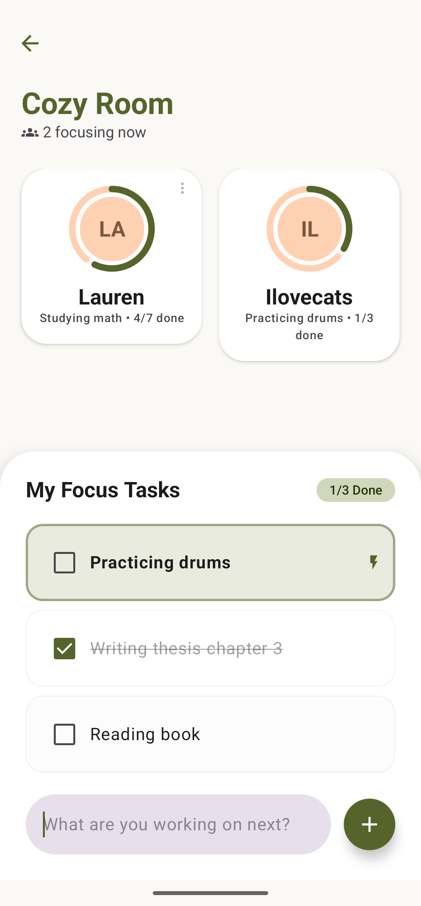
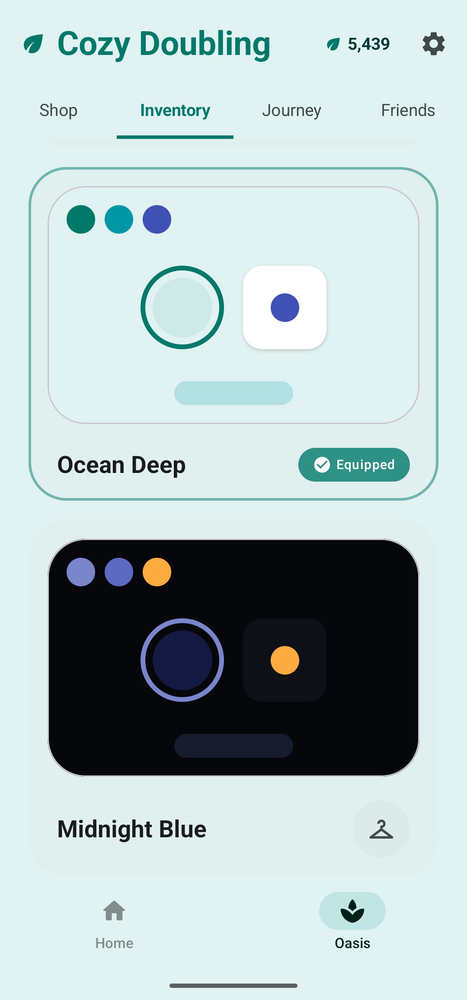

# 🌿 Cozy Doubling

**A quiet space to focus together, unhurried and calm.**

Cozy Doubling is an Android application designed to provide a peaceful environment for co-working, studying, or simply focusing on what matters most. Built with a focus on minimalism and a "cozy" aesthetic, it helps users find their flow in a digital oasis.

---

## 📥 Download

Cozy Doubling is now available on the Google Play Store!

---

## ✨ Features

- **Focus Rooms**: Join or create quiet spaces for deep work.
- **Economy & Rewards**: Progress through your focus journey and unlock cozy themes.
- **Real-Time Sync**: Real-time updates across devices.
- **Privacy First**: Built with transparency and secure authentication.

---

## 📸 Screenshots

| Home Screen | Focus Room | Oasis |
| :---: | :---: | :---: |
|  |  |  |

---

## 🛠 Tech Stack

- **UI**: [Jetpack Compose](https://developer.android.com/jetpack/compose) (Material 3)
- **Backend**: [Supabase](https://supabase.com/) (Auth, Database, Realtime, Functions)
- **Navigation**: Compose Navigation
- **Payments**: RevenueCat & Google Play Billing
- **Architecture**: MVVM with Kotlin Coroutines & Flow

---

## 📄 License

This project is licensed under a **Source Available License**. 

You are free to view, download, and learn from the source code for personal and educational use. Commercial use, redistribution, or cloning of the app for public release is strictly prohibited. 

See the [LICENSE](LICENSE) file for full details.
